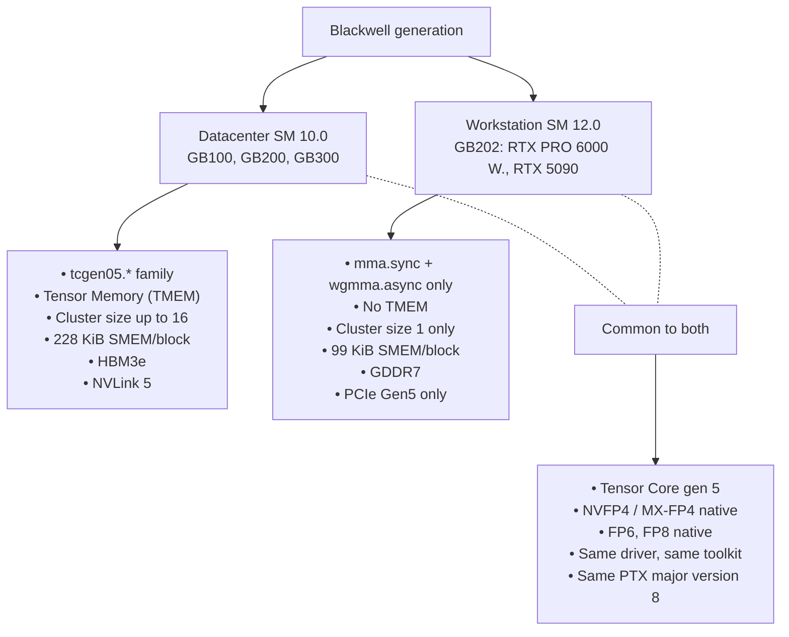

# Blackwell

NVIDIA's GPU generation released 2024–2026. This section covers the architectural details that distinguish Blackwell from preceding generations, and (more importantly) that distinguish the **two halves of Blackwell** from each other.

## Pages in this section

- [`sm100-vs-sm120`](sm100-vs-sm120.md) — the architectural split, in detail
- [`tcgen05-and-tmem`](tcgen05-and-tmem.md) — the new Tensor Core ISA family (datacenter only)
- [`thread-block-clusters`](thread-block-clusters.md) — multi-CTA cooperation, what works on each half
- [`nvfp4-deep-dive`](nvfp4-deep-dive.md) — NVIDIA's FP4 variant, native on both halves

## What's not here

- **General Tensor Core background**: in [`fundamentals/tensor-cores`](../fundamentals/tensor-cores.md).
- **NVFP4 against the broader number-format landscape**: in [`fundamentals/number-formats`](../fundamentals/number-formats.md).
- **Interconnect and MoE**: in [`interconnect/`](../interconnect/index.md). NVLink is technically a Blackwell-generation feature too, but the conceptual unit is interconnect, so it lives in its own section.

## The map

## Reading order

Read [`sm100-vs-sm120`](sm100-vs-sm120.md) first — it's the central page, listing every architectural difference with citations to the next-level pages. Then read whichever sub-pages you need based on the differences that matter to your work.

## Why the split exists (briefly)

NVIDIA chose to separate datacenter and consumer Blackwell into different silicon families for several reasons that show up indirectly:

- **Die area economics**: TMEM, large NVLink bridges, and HBM controllers are expensive in mm². A consumer card that includes them is harder to price competitively.
- **Workload differences**: consumer Blackwell targets visualization, content creation, and small-scale ML. The cost-of-feature tradeoff for `tcgen05` (only useful for very large MMAs) is poor at consumer scale.
- **Product segmentation**: NVIDIA wants the datacenter-class features to remain a paying-customer feature.

This is **not new** — Volta and Turing were similarly split, as were Ampere (A100 datacenter vs RTX 30) and Hopper (H100 vs there's-no-consumer-Hopper-because-Lovelace-took-that-slot). The Blackwell split is unusual mainly because the **branding** ("RTX PRO 6000 Blackwell") is so close to identical between the two halves that buyers are routinely surprised to discover they got something different than expected.
