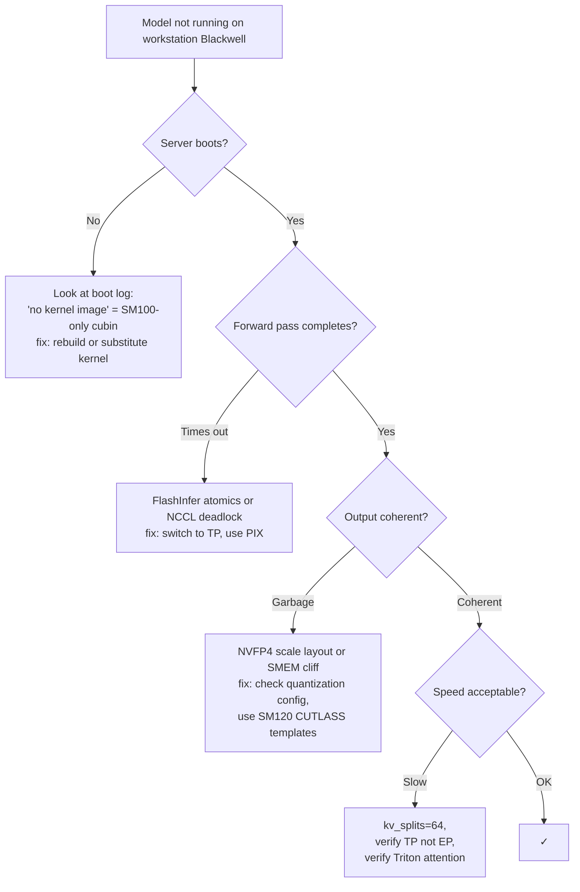

# Generic MoE on consumer Blackwell

A diagnostic procedure for any MoE model not yet in the case studies. Apply this checklist when you encounter a new release.

## Step 1: Survey the model release

Read the model card and release notes. Answer:

- **Total parameters and active parameters**: does the NVFP4-quantized version fit your VRAM budget?
- **Number of experts and top-k**: high N with high k is more bandwidth-hungry
- **Attention variant**: MHA / GQA (universal) vs MLA / DSA / NSA / custom (kernel-specific)
- **Reference inference engine**: vLLM, sglang, TRT-LLM, or a custom fork?
- **Reference quantization format**: NVFP4? MX-FP4? FP8? GPTQ?
- **Hardware they tested on**: H100, B100, NVL72? This tells you what assumptions they made.

If the model card mentions DeepGEMM, NVSHMEM, DeepEP, or `sm_100a`-specific compilation, expect issues on workstation Blackwell.

## Step 2: Check the kernel surface

For each kernel library the model depends on, check its SM120 status against [`kernels/`](../kernels/index.md):

| Library | SM120 status |
| --- | --- |
| CUTLASS | ✓ with caveats (SMEM cliff) |
| FlashAttention 2 | ✓ |
| FlashAttention 3 | ✗ no Blackwell port |
| FlashInfer (attention) | ✓ |
| FlashInfer (MoE one-shot a2a) | needs P2P atomics |
| DeepGEMM | ✗ as of early 2026 |
| NVSHMEM-based all-to-all | ✗ without NVLink |
| DeepEP (intranode/internode) | ✗ |
| Marlin | ✓ |
| Triton | ✓ |
| TransformerEngine | partial |

Anything in the ✗ rows means you can't use the model's reference deployment recipe directly; you need to substitute alternatives.

## Step 3: Decide on a parallelism plan

Given that workstation Blackwell has no NVLink and likely no P2P atomics:

```
Does the NVFP4 model + KV cache fit in (N × 96 GB)?
├── Yes → use TP=N parallelism, no EP
└── No → consider:
        ├── Pruning the model (REAP-style) to bring expert count down
        ├── PP=2 (split layers across GPU pairs) at latency cost
        └── Smaller / lower-precision (W4A16 via Marlin) variants
```

For most modern MoE models in the 100B–500B parameter range, NVFP4 + TP-only fits if you have 4× 96 GB.

## Step 4: Configure the inference engine

Generic flag template (translate to your engine's syntax):

```yaml
quantization: nvfp4
kv_cache_dtype: fp8_e4m3
attention_backend: auto              # let engine pick Triton on SM120
triton_attention_num_kv_splits: 64   # the high-impact knob
tensor_parallel_size: 4              # or however many GPUs
pipeline_parallel_size: 1
disable_deepgemm: true               # SM100-only as of early 2026
disable_expert_parallelism: true     # avoid all-to-all
mem_fraction_static: 0.94            # safer than 0.97
```

NCCL hygiene environment vars:

```bash
NCCL_P2P_LEVEL=PIX           # only same-switch P2P; cross-RC goes through host
NCCL_IB_DISABLE=1            # no InfiniBand on consumer rigs
NCCL_SHM_DISABLE=0           # allow host shared memory
NCCL_BUFFSIZE=4194304        # 4MB buffers
TORCH_NCCL_BLOCKING_WAIT=1
```

## Step 5: Smoke test

Three increasingly demanding tests:

### A. Boot + listing

```bash
curl -sS http://localhost:8000/v1/models
```

If this fails, there's a startup issue (kernel load, weight load, NCCL init). Check the boot log.

### B. Short greedy generation

```bash
curl -sS http://localhost:8000/v1/chat/completions \
  -H 'Content-Type: application/json' \
  -d '{"model":"<model_name>","messages":[{"role":"user","content":"What is 7 squared? One word."}],"max_tokens":10}'
```

Should produce a coherent answer. If you get gibberish, you're hitting:

- Wrong NVFP4 scale layout (silent corruption)
- SMEM cliff in a CUTLASS template
- KV cache misconfiguration

### C. Long-context coherence

```bash
# A long prompt with a key fact at position ~50k
prompt="(50k tokens of filler) ... The secret is XYZ. ... (more filler)"
curl ... '{"messages":[{"role":"user","content":"<prompt> What is the secret?"}],"max_tokens":50}'
```

If short-context works but long-context fails:

- kv_splits is at the default 8 (set to 64)
- Triton attention isn't selected (force `attention_backend=triton`)
- Page-size mismatch (try `page_size=128`)

## Step 6: Performance validation

Compare your decode tok/s to expected:

| Model size | Expected decode tok/s on 4× workstation Blackwell |
| --- | --- |
| ~250 B parameters | 50–80 |
| ~478 B (REAP-pruned) | 30–50 |
| ~700 B (full, with PP) | 10–25 |
| Anything below 100 B | 80–150 |

If you're significantly below these, look for:

- EP accidentally active (check NCCL trace for `all_to_all`)
- Wrong attention backend
- DeepGEMM accidentally enabled
- Memory pressure (reduce `mem_fraction_static`)

## A diagnostic flowchart



## When the model just doesn't fit

Some models (anything > 700 B with full expert count) genuinely don't fit 4× 96 GB even with NVFP4. Options:

- **Wait for a pruned release.** Many frontier labs publish REAP-style pruned variants months after the original.
- **Use a smaller variant.** V4-Flash instead of V4, K2.6 with 256 experts instead of 384, GLM-5.1 REAP-160 instead of full.
- **Hybrid TP × PP.** Split layers across pairs of GPUs. Memory per GPU drops; latency increases.
- **Lower precision.** Marlin-W4A16 if NVFP4 weights aren't available. ~2× slower than NVFP4 on Tensor Cores but fits more memory.

## A note on iteration speed

When porting a model to workstation Blackwell, expect to iterate 5–15 times on the configuration before everything works smoothly. The space of (engine, kernel, quantization, KV format, attention backend, parallelism plan, env-var hygiene) is large, and silent-corruption modes are common. Plan for an afternoon of trial-and-error per new model, even with this checklist.

## See also

- [`compatibility/`](../compatibility/index.md) — the underlying patterns
- [`kernels/inference-engines`](../kernels/inference-engines.md) — engine-specific flags
- The other case studies for concrete examples
