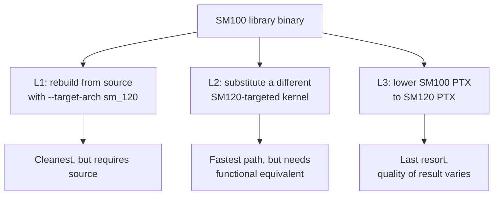

# Compatibility patterns

General patterns for bridging SM100-targeted software to SM120 hardware. Pure techniques, not a specific implementation.

## The three layers

Each layer has tradeoffs. The right answer depends on what you have and what your performance budget is.

## Pages in this section

- [`translating-tcgen05`](translating-tcgen05.md) — patterns for rewriting `tcgen05` PTX as `mma.sync` chains
- [`smem-budget-management`](smem-budget-management.md) — fitting kernels into the 99 KiB SMEM ceiling
- [`cluster-rewriting`](cluster-rewriting.md) — what to do about kernels that assume cluster size > 1
- [`ep-to-tp-rewriting`](ep-to-tp-rewriting.md) — restructuring expert-parallel plans into tensor-parallel ones
- [`runtime-detection`](runtime-detection.md) — detecting topology and architecture at startup, dispatching accordingly

## When to use each

| Situation | Best approach |
| --- | --- |
| Open-source library, you have build infrastructure | **L1**: rebuild with SM120 target. Cleanest. |
| Pre-built library, no source available | **L2**: substitute. Use a different kernel library that has SM120 support. |
| Specific kernel needs to work, no equivalent exists | **L3**: lower the PTX. Most work, lowest performance, but always feasible. |
| Issue is at parallelism plan, not kernel | **None of the above**: rewrite the plan instead. See [`ep-to-tp-rewriting`](ep-to-tp-rewriting.md). |

## A note on philosophy

These patterns are **describing techniques**, not advocating for any specific automation. Tools that automate them (compatibility shims, transpilers, plan rewriters) exist, but the patterns themselves are conceptual: how do you take an SM100-targeted thing and make it work on SM120?

The patterns don't make consumer Blackwell as fast as datacenter Blackwell. They make it **work**. The performance gap is hardware-fundamental: less memory bandwidth, fewer SMs, no NVLink. Software techniques close maybe half the gap; the other half is silicon.

## Reading order

If you're porting a specific kernel: read [`translating-tcgen05`](translating-tcgen05.md) and [`smem-budget-management`](smem-budget-management.md) — those cover the two most common SM100-only constructs.

If you're working at the system level: [`ep-to-tp-rewriting`](ep-to-tp-rewriting.md) is the highest-impact pattern. A correct plan rewrite often eliminates the need for kernel-level work.

If you're building tooling: [`runtime-detection`](runtime-detection.md) describes the data structures and probes you'd need.
