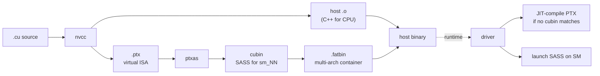

# The CUDA compilation pipeline

How a `.cu` source file becomes instructions that an SM executes. Understanding this pipeline is essential because most SM100/SM120 incompatibilities surface as failures *somewhere along this pipeline*.

## The pipeline at a glance



The key insight is that `.cu` source goes through **two compilation steps**: a high-level one (`nvcc` / NVCC's PTX backend) and a low-level one (`ptxas`). Each step can succeed or fail for different reasons.

## Step 1: nvcc → PTX

`nvcc` is a driver-style compiler that:

1. Splits `.cu` source into host code (C++) and device code (CUDA C++)
2. Compiles host code with a host C++ compiler (gcc/clang/cl)
3. Compiles device code through its own front-end down to PTX

PTX (**Parallel Thread eXecution**) is NVIDIA's **virtual ISA** — an architecture-independent (within limits) intermediate representation. Think of it like LLVM IR but specifically for GPU code.

You target a specific PTX version with the `--gpu-architecture` (or `-arch`) flag:

```
nvcc -arch=compute_100 ...   # PTX targeting compute capability 10.0
nvcc -arch=compute_120 ...   # PTX targeting compute capability 12.0
```

PTX is **forward-compatible within a major version**: PTX targeting `compute_70` can be JIT-compiled and run on any later architecture (8.0, 9.0, 10.0, 12.0). PTX targeting `compute_100` can only run on 10.0 and later 1x.x architectures, but **not** on 12.0 (because 10.0 introduced instructions like `tcgen05` that 12.0 doesn't support — different "branch" of the 1x family).

### What can go wrong here

- **Missing instruction**: source uses an intrinsic (`__hadd2`, `__nvvm_reflect`, `cp.async.bulk.tensor`) not available at the targeted PTX version. Compile error.
- **Architecture-specific intrinsic on wrong target**: source uses `tcgen05.mma` but compiles with `-arch=compute_120`. Compile error: "instruction not supported in this PTX version."
- **Forward-compat violation in the source**: code uses `__CUDA_ARCH__` macros to gate datacenter-only paths but the gate is wrong. Often produces working PTX that fails at runtime.

## Step 2: PTX → SASS via ptxas

`ptxas` (the PTX assembler) lowers PTX to **SASS** — the actual per-architecture machine code that executes on the SM. SASS is documented sparsely; you mostly interact with it via `nvdisasm` or `cuobjdump --dump-sass`.

You target a specific SASS architecture with the `--gpu-code` (or `-code`) flag:

```
ptxas --gpu-name=sm_100  ...
ptxas --gpu-name=sm_120  ...
```

Or together with `nvcc`:

```
nvcc -gencode arch=compute_100,code=sm_100   ...
nvcc -gencode arch=compute_120,code=sm_120   ...
```

The `-gencode` form generates SASS for a specific architecture *and* embeds PTX (which can be JIT-compiled if the binary runs on a future architecture not in the gencode list).

### The `a` and `f` suffixes

NVIDIA introduced two suffixes to manage architecture-specific features:

| Suffix | Meaning | Example |
| --- | --- | --- |
| (none) | "Portable" subset of the architecture | `sm_100` |
| `a` | "Architecture-specific accelerated" — uses non-portable features. Code runs *only* on this exact arch. | `sm_100a` |
| `f` | "Forward-compatible" — restricted to instructions that will exist on this arch and any future same-major arch | `sm_120f` |

Practically:

- **`sm_100a`** allows `tcgen05` instructions, MNNVL fabric calls, and other GB100-specific features. The compiled SASS runs only on a 10.0 device.
- **`sm_100`** is a more conservative target that omits those features.
- **`sm_120a`** allows GB202-specific features (e.g., specific Tensor Core variants only present on consumer Blackwell), runs only on 12.0.
- **`sm_120f`** is a "future-proof" subset that will run on `sm_120` and any later 12.x arch. Useful for libraries shipping to a wide range of consumer Blackwell SKUs.

The choice of suffix appears in NVIDIA's own libraries:

- CUTLASS Blackwell templates use **`sm_100a`** because they need `tcgen05`
- A workstation port would target **`sm_120`** or **`sm_120f`**, omitting `tcgen05`

### What can go wrong here

- **Instruction not available**: PTX contains `tcgen05.mma` but `--gpu-name=sm_120`. ptxas error.
- **SMEM over-allocation**: PTX requests more SMEM than the target architecture has. ptxas may warn but produce a binary that fails at runtime.
- **Register file overflow**: PTX wants more registers per thread than the target supports. ptxas spills to local memory (an HBM-backed thread-private region), which is slow.
- **Cluster shape unsupported**: PTX declares `.cluster_dim 2,1,1` but target arch doesn't support clusters or supports a smaller maximum.

## Step 3: cubin and fatbin

A **cubin** is the compiled binary for one specific architecture: it contains SASS for `sm_NN` and optionally embedded PTX.

A **fatbin** is a container with cubins for multiple architectures plus optional PTX. When you specify multiple `-gencode` flags to `nvcc`, you get a fatbin:

```
nvcc -gencode arch=compute_80,code=sm_80 \
     -gencode arch=compute_90,code=sm_90 \
     -gencode arch=compute_100,code=sm_100a \
     -gencode arch=compute_120,code=sm_120 \
     -gencode arch=compute_120,code=compute_120 \
     ...
```

The last line (`code=compute_120`) embeds **PTX** for `compute_120`, which the driver can JIT-compile to SASS at load time if no matching cubin exists.

### Inspecting fatbins

```bash
cuobjdump --list-elf  myapp           # see what arches are inside
cuobjdump --dump-elf  myapp           # dump SASS
cuobjdump --dump-ptx  myapp           # dump embedded PTX
```

This is how you discover, in practice, that a pre-built library targets `sm_100a` and not `sm_120` — its fatbin contains only `sm_100a` cubins.

## Step 4: runtime — driver, JIT, launch

When a CUDA program loads a kernel:

1. The driver looks up the kernel in the fatbin.
2. If a cubin matching the device's architecture is present, the driver loads that cubin directly.
3. If no matching cubin is present, the driver looks for embedded PTX. If found, JIT-compiles it.
4. If neither is found, the kernel load fails with an error like `CUDA error: no kernel image is available for execution on the device`.

For SM120 trying to load an SM100-only fatbin, the load fails at this step. **This is the first place users encounter the SM100/SM120 split.**

The driver caches JIT results across runs, so the first launch is slow but subsequent launches are fast. The cache lives at `~/.nv/ComputeCache/` on Linux.

## A worked example: chasing a `tcgen05` error

Suppose you `pip install` a kernel library, run it on an SM120 card, and get:

```
CUDA error: no kernel image is available for execution on the device
```

You'd debug along the pipeline:

1. **Find the .so**: locate the shared library that contains the kernel.
2. **Inspect the fatbin**: `cuobjdump --list-elf libfoo.so | grep arch`. Output:
   ```
   arch = sm_90
   arch = sm_100a
   ```
   No `sm_120` cubin → that's why the load fails.
3. **Check for PTX fallback**: `cuobjdump --dump-ptx libfoo.so | head`. If PTX exists, look at its target:
   ```
   .version 8.5
   .target sm_100a
   ```
   Target is `sm_100a` → JIT to `sm_120` will fail too (different major-version branch in 1x).
4. **Read the PTX**: search for `tcgen05`. If present:
   ```
   tcgen05.alloc.cta_group::1 %rd5, 16384;
   ```
   Confirmed: the kernel uses datacenter-only instructions. There's no automatic fallback.

The fix at this point is either:

- Recompile from source with `-arch=compute_120` and a different (SM120-targeted) implementation
- Substitute a different kernel library that has SM120 support
- Run on a datacenter Blackwell card

You cannot simply "force" the SM100 kernel to run on SM120 — the instructions are different machine-level operations.

## Compilation flags cheat sheet

The most useful nvcc flags for understanding what's happening:

```bash
nvcc -keep -keep-dir build/intermediate ...   # keep intermediate files
nvcc --ptxas-options=-v ...                   # ptxas verbose: SMEM/register usage
nvcc --resource-usage ...                     # print register/SMEM usage per kernel
nvcc -G ...                                   # generate device debug info
nvcc -lineinfo ...                            # source line info in SASS (for ncu)
```

For inspecting compiled binaries:

```bash
cuobjdump --list-elf libfoo.so                # what arches are in this fatbin
cuobjdump --dump-elf libfoo.so > sass.txt     # dump SASS
cuobjdump --dump-ptx libfoo.so > ptx.txt      # dump PTX
nvdisasm sass.txt                              # disassemble SASS
```

## Checkpoint

You should be able to answer:

- What's the difference between PTX and SASS?
- What's the difference between `sm_100`, `sm_100a`, and `sm_100f`?
- If a kernel works on H100 but not on B100, what's the most likely problem?
- If a kernel works on B100 but not on RTX 5090, what's the most likely problem?
- Why does the driver have a JIT path?

## See also

- [`tensor-cores`](tensor-cores.md) — what `mma.sync` and `tcgen05.mma` actually are
- [`blackwell/sm100-vs-sm120`](../blackwell/sm100-vs-sm120.md) — the specific PTX-and-SASS differences
- [`compatibility/translating-tcgen05`](../compatibility/translating-tcgen05.md) — how to lower SM100 PTX to SM120 PTX
- NVIDIA *PTX ISA* specification (8.5 as of 2026)
- NVIDIA *CUDA Binary Utilities* documentation
