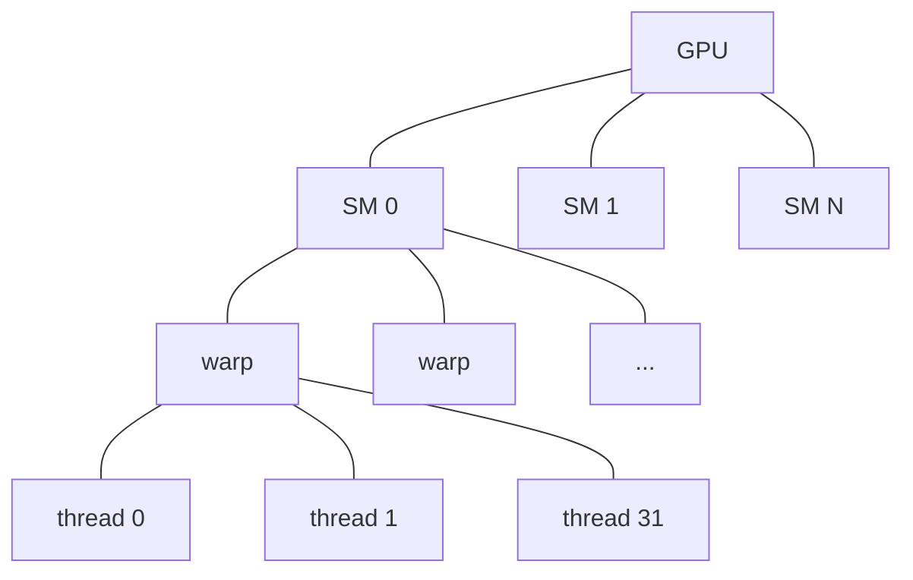

# GPU execution model

How NVIDIA GPUs execute kernels. The hierarchy from kernel launch down to individual lanes, and the SIMT (Single Instruction, Multiple Threads) abstraction that ties it together.

## The hierarchy

```
Kernel launch
  └── Grid                     — collection of CTAs (Cooperative Thread Arrays)
        └── CTA / "Block"       — collection of warps; lives on a single SM
              └── Warp           — 32 threads, executes in lock-step
                    └── Thread   — one logical execution lane
```

A **kernel** is a function callable from host (CPU) code. Launching a kernel means specifying a grid shape (how many CTAs) and a block shape (how many threads per CTA), then enqueueing the call onto a CUDA stream. The driver routes the kernel to the device, the device's SMs claim CTAs as resources allow, and execution proceeds.

| Term | What it is | Typical size |
| --- | --- | --- |
| **Grid** | The full launch | up to 2³¹−1 CTAs |
| **CTA / Block** | A scheduled unit, lives on one SM | 32–1024 threads |
| **Warp** | The execution unit | exactly 32 threads, always |
| **Thread / Lane** | One logical instruction stream | 1 |

Two terms are used interchangeably:
- **CTA** (Cooperative Thread Array) — NVIDIA's formal term
- **Block** — the term used in CUDA C++ (`__syncthreads()` syncs a block, etc.)

## Streaming multiprocessors (SMs)

A GPU is a collection of **SMs** (Streaming Multiprocessors). Each SM:

- Has its own registers, shared memory (SMEM), L1 cache
- Schedules warps from CTAs assigned to it
- Has its own Tensor Cores, ALUs, special function units
- Runs warps from up to ~16 different CTAs concurrently (depending on occupancy)

A modern Blackwell GPU has 60–144 SMs, depending on the SKU. The number of SMs determines peak throughput.



A CTA is assigned to one SM at launch and stays there for its lifetime. CTAs cannot migrate across SMs.

## SIMT execution

Threads within a warp execute the **same instruction in lock-step**. This is the "Single Instruction, Multiple Threads" abstraction: 32 threads issue the same op, each on its own data.

What happens on a divergent branch (where some threads in a warp take the `if`, others take the `else`)? The hardware **serializes** the two paths — first executes the `if`-branch with the `else`-branch threads masked off, then the `else`-branch with the `if`-branch threads masked off. This is called **warp divergence** and is a primary performance concern.

Within a warp, threads can communicate via:

- **Warp shuffle** instructions (`__shfl_sync`, `__shfl_up_sync`, etc.) — direct register-to-register transfers between lanes
- **Warp vote** instructions (`__ballot_sync`, `__all_sync`, `__any_sync`) — collective predicates
- **Warp matrix** instructions (`mma.sync`) — the Tensor Core MMA we'll cover later

Across warps within a CTA, threads communicate via:

- **Shared memory** (SMEM) — programmer-managed scratchpad
- **`__syncthreads()`** — barrier synchronization

Across CTAs there is no synchronization in the standard model — CTAs are independent, completing in unspecified order. This changes with **thread block clusters** (Hopper+), which we'll cover in [`blackwell/sm100-vs-sm120`](../blackwell/sm100-vs-sm120.md).

## Occupancy

How many warps from how many CTAs an SM can run concurrently is bounded by:

- **Register pressure** — each thread holds N registers; the SM has a fixed register file (e.g., 64K 32-bit registers/SM)
- **SMEM use per CTA** — bounded by SMEM/SM (e.g., 99 KiB on SM120)
- **Threads per SM** — hardware limit, typically 1024 or 2048
- **CTAs per SM** — hardware limit, typically 32

The product of these constraints determines **occupancy** — the fraction of theoretical maximum warps actually resident. Higher occupancy hides latency (one warp stalls, another runs); too high occupancy spreads register/SMEM resources thin.

Tensor-Core-heavy kernels often run at relatively **low** occupancy intentionally — they need more registers and SMEM per warp to feed the matrix-multiply pipeline, and the Tensor Cores themselves don't need many warps to stay busy.

## Async execution and streams

Kernel launches are **asynchronous** from the host's perspective. The host enqueues a kernel onto a CUDA stream and continues; the kernel runs on the device when scheduling allows.

A **stream** is an ordered sequence of operations (kernels, memcpy, events). Operations within a stream serialize; operations across streams can overlap. Modern inference engines aggressively pipeline using multiple streams.

## Cooperative groups (briefly)

CUDA exposes a `cooperative_groups` namespace that abstracts the warp/block/cluster hierarchy. You'll see `tile<32>`, `block_tile<32>`, `coalesced_threads`, etc. in modern CUDA C++. This is mostly a quality-of-life wrapper over the underlying hierarchy described above.

## Why this matters for Blackwell

Two execution-model changes are central to the SM100/SM120 story:

1. **Thread block clusters** (introduced Hopper, expanded Blackwell datacenter): a way to group multiple CTAs that share an SM-cluster's distributed shared memory. SM100 supports up to **cluster size 16**; SM120 supports only **cluster size 1** (no actual clustering). Kernels written for `cluster(2,1,1)` won't behave correctly on SM120.

2. **Async-everything**: SM100's `tcgen05` family decouples Tensor Core execution from warp execution. The MMA fires asynchronously; the warp continues; synchronization is via Tensor Memory or completion barriers. This pushes the SIMT model harder than ever before. SM120 doesn't have `tcgen05`, so it's stuck with the older synchronous `mma.sync` style. Kernels that assumed async overlap on SM100 lose that overlap when ported.

Both changes are covered in [`blackwell/sm100-vs-sm120`](../blackwell/sm100-vs-sm120.md) and [`blackwell/tcgen05-and-tmem`](../blackwell/tcgen05-and-tmem.md).

## Checkpoint

You should be able to answer:

- What's the difference between a thread, a warp, and a CTA?
- How do threads within a warp communicate?
- How do warps within a CTA communicate?
- Why might a kernel run at 25 % occupancy intentionally?
- What's the relationship between a CTA and an SM during execution?

## See also

- [`memory-hierarchy`](memory-hierarchy.md) — how data flows under this execution model
- [`tensor-cores`](tensor-cores.md) — the matrix-multiply hardware
- NVIDIA *CUDA C++ Programming Guide*, ch. 5 (Execution Model) and ch. 12 (Cooperative Groups)
