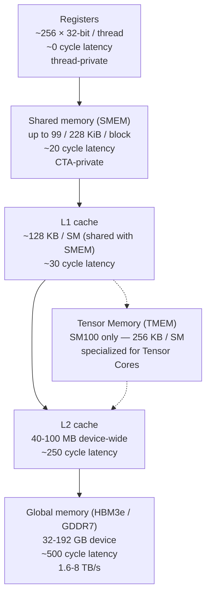

# Memory hierarchy

Where data lives on a GPU. Six tiers, each with different size, bandwidth, latency, and visibility scope.

## The pyramid



The arrows represent the **data flow** for a typical compute kernel: load from global → stage in shared → consume in registers → produce results back through the chain.

## Per-tier detail

### Registers

- **Capacity**: 255 32-bit registers per thread (CUDA limit, may go lower with `__launch_bounds__`)
- **Latency**: effectively zero
- **Bandwidth**: ~30 TB/s/SM (each thread can read multiple registers per cycle)
- **Scope**: per-thread, no sharing
- **Allocation**: by the compiler; you don't control which physical register holds which variable, but you control which variables exist

The register file is the bottleneck for occupancy on compute-bound kernels. Each SM has a fixed register file (e.g., 64K registers); 256 registers/thread × 32 threads/warp × 8 warps/CTA × 2 CTAs/SM ≈ 128K — already over budget. So in practice you compromise: lower per-thread register use, or fewer concurrent CTAs, or both.

### Shared memory (SMEM)

The on-chip programmer-managed scratchpad. **The single most important number in this wiki:**

| Architecture | Per-block ceiling | Per-SM total |
| --- | ---: | ---: |
| Volta (SM 7.0) | 96 KiB | 96 KiB |
| Ampere (SM 8.0) | 164 KiB | 164 KiB |
| Hopper (SM 9.0) | 228 KiB | 228 KiB |
| **Blackwell datacenter (SM 10.0)** | **228 KiB** | 228 KiB |
| **Blackwell workstation (SM 12.0)** | **99 KiB** | 99 KiB |

The 99 KiB workstation Blackwell ceiling is *substantially* lower than its Hopper-era cousin. Many kernel libraries (CUTLASS, FlashAttention) have templates that auto-size pipeline stages assuming a 228 KiB ceiling. On SM120 those templates request more SMEM than is allocatable. See [`blackwell/sm100-vs-sm120`](../blackwell/sm100-vs-sm120.md) for the consequences.

SMEM properties:

- **Latency**: ~20–30 cycles
- **Bandwidth**: ~10 TB/s/SM (when banks are accessed without conflict)
- **Scope**: CTA-private
- **Banks**: SMEM is 32-banked; consecutive 4-byte words map to consecutive banks. Bank conflicts (two threads in a warp accessing the same bank, different addresses) serialize.

CUDA exposes static SMEM (sized at compile time, declared with `__shared__`) and dynamic SMEM (sized at launch time, opted into via the launch's third parameter). For dynamic SMEM exceeding the architecture's "default" carveout (49 KiB on most arches), you need `cudaFuncSetAttribute(kernel, cudaFuncAttributeMaxDynamicSharedMemorySize, N)` before launch.

### Tensor Memory (TMEM)

**SM100 only.** A new on-chip memory class introduced with datacenter Blackwell. Holds Tensor Core accumulators decoupled from registers.

- **Capacity**: 256 KB/SM (separate from SMEM)
- **Bandwidth**: high enough to feed `tcgen05.mma` at peak
- **Scope**: warp-group/CTA, allocated via `tcgen05.alloc`
- **Latency**: hidden behind async TMA / `tcgen05.commit` operations

TMEM exists because the largest `tcgen05.mma` tile (m256n128k64) accumulates into 32 KB of result data — far more than fits in registers, and a poor fit for SMEM (would consume the entire budget). TMEM gives the Tensor Core a private accumulator space, freeing registers and SMEM for other work.

**SM120 has no equivalent.** Any kernel that uses TMEM must be rewritten to either chunk into smaller tiles (smaller accumulators that fit in registers) or stage accumulators through SMEM (consuming the 99 KiB budget). See [`compatibility/translating-tcgen05`](../compatibility/translating-tcgen05.md).

### L1 / L2 caches

**L1**: per-SM, shares hardware budget with SMEM. The combined L1+SMEM is 228 KiB on Hopper/Blackwell-DC, 128 KiB on Blackwell-WS. The split between L1 and SMEM is dynamic; the SMEM carveout you request determines L1 size.

**L2**: device-wide, 40 MB on H100, 50 MB on B100, ~96 MB on B200, somewhat smaller on consumer Blackwell. L2 caches accesses to global memory, hides some HBM latency.

Caches are mostly automatic; you don't manage them directly. Cache control hints (`ld.cg`, `ld.cs`, `ld.ca`) let you bias the hierarchy slightly.

### Global memory (HBM / GDDR)

Off-chip device memory. The deepest, slowest, largest tier.

| GPU | Memory | Capacity | Bandwidth |
| --- | --- | ---: | ---: |
| A100 80GB | HBM2e | 80 GB | 2.0 TB/s |
| H100 80GB | HBM3 | 80 GB | 3.4 TB/s |
| H200 | HBM3e | 141 GB | 4.8 TB/s |
| B100 | HBM3e | 192 GB | 8.0 TB/s |
| B200 | HBM3e | 192 GB | 8.0 TB/s |
| RTX PRO 6000 Workstation | GDDR7 | 96 GB | ~1.8 TB/s |
| RTX 5090 | GDDR7 | 32 GB | ~1.8 TB/s |

The bandwidth gap between datacenter HBM and consumer GDDR is roughly **4–5×**. For memory-bound workloads (which long-context decode largely is) this is one of the architectural performance gaps that no software bridge can close.

Access patterns matter: a fully **coalesced** access (32 threads in a warp accessing a contiguous 128-byte segment) achieves peak bandwidth. A scattered or strided access can drop to a small fraction of peak. The HBM/GDDR bandwidth numbers above are peak; achievable bandwidth depends on your access pattern.

## A concrete sizing example

Suppose you're writing a CUTLASS GEMM at NVFP4 with tile shape `m128n128k64`:

- **Operands**: `A` is 128×64 = 8192 elements at 4 bits = 4096 bytes (plus scales). `B` is 64×128 = 4096 bytes. Total operand size per tile: ~9 KB.
- **Pipeline stages**: to overlap loads with compute, you'd typically allocate 3–4 stages of operands in SMEM. 4 stages × 9 KB = 36 KB.
- **Accumulator**: 128×128 × 4 bytes (FP32 accum) = 64 KB. On SM100, this lives in TMEM. On SM120, it must live in registers (which it doesn't fit) or SMEM (which would push the budget to 36 + 64 = 100 KB — *over* the 99 KiB ceiling).

This is the SMEM cliff in concrete form. The CUTLASS Blackwell templates handle it via TMEM on SM100, leaving the SMEM budget for operands. Without TMEM, the template's `StageCountAutoCarveout` underestimates available SMEM, allocates too aggressively, and the launch corrupts adjacent banks.

## Memory access PTX

Three flavors of load instructions, ordered by scope:

```ptx
ld.global.u32 %r0, [%addr];   // global memory load
ld.shared.u32 %r0, [%addr];   // SMEM load
ld.local.u32  %r0, [%addr];   // thread-local memory load (reg spill)
```

For Tensor Core work, additional specialized loads exist:

```ptx
ldmatrix.sync.aligned.x4.shared.b16  ...   // load matrix tile from SMEM (Ampere+)
cp.async.ca.shared.global             ...   // async copy global→SMEM (Ampere+)
cp.async.bulk.tensor.shared::cluster.global ... // TMA (Hopper+, datacenter)
tcgen05.cp.shared::cta::tmem.b64      ...   // TMEM copy (datacenter Blackwell only)
```

The set of available memory instructions narrows significantly on SM120 compared to SM100. Specifically, **TMEM copies, cluster-shared TMA, and `tcgen05.cp` are absent on SM120**.

## Checkpoint

You should be able to answer:

- What's the per-block SMEM ceiling on workstation Blackwell? On datacenter Blackwell?
- Why does SM100's TMEM exist? What does SM120 do instead?
- What does it mean for a memory access to be coalesced?
- Roughly what's the bandwidth ratio between datacenter HBM3e and workstation GDDR7?
- Why is the L1+SMEM split sometimes called a "carveout"?

## See also

- [`gpu-execution-model`](gpu-execution-model.md) — how threads/warps/CTAs interact with this hierarchy
- [`tensor-cores`](tensor-cores.md) — what consumes the Tensor Memory tier
- [`blackwell/sm100-vs-sm120`](../blackwell/sm100-vs-sm120.md) — detailed treatment of the SMEM and TMEM differences
- NVIDIA *CUDA C++ Programming Guide*, ch. 6 (Memory Hierarchy)
