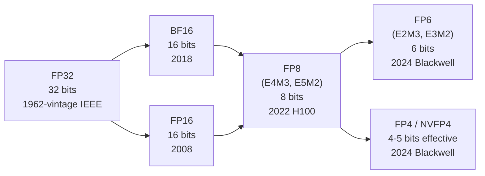

# Number formats

The encoding of every number a Tensor Core multiplies. The diversity of formats is the dominant story of the Hopper-and-Blackwell era.

## The bit-width story



Each generation of formats roughly **halves storage** while retaining usable accuracy for ML workloads. The trick is increasingly aggressive **scaling**: as bit-width drops, dynamic range becomes the bottleneck, so formats partition values into blocks with per-block scale factors.

## Floating-point format crash course

A floating-point number is `(sign)(2^exponent)(1.mantissa)`, with bias on the exponent. The encoding is **1 + E + M bits** where E is exponent bits and M is mantissa bits. More E → wider range; more M → finer precision.

| Format | Bits | E | M | Range (approx) | Precision (approx) |
| --- | ---: | ---: | ---: | --- | --- |
| FP32 (IEEE 754) | 32 | 8 | 23 | ±10⁻³⁸ to ±10³⁸ | ~7 decimal digits |
| TF32 (Tensor Core internal) | 19 | 8 | 10 | ±10⁻³⁸ to ±10³⁸ | ~3 decimal digits |
| FP16 (IEEE 754 binary16) | 16 | 5 | 10 | ±6×10⁻⁵ to ±65 504 | ~3 digits |
| BF16 (Brain float) | 16 | 8 | 7 | ±10⁻³⁸ to ±10³⁸ | ~2 digits |
| FP8 E4M3 | 8 | 4 | 3 | ±2⁻⁹ to ±448 | ~1.3 digits |
| FP8 E5M2 | 8 | 5 | 2 | ±2⁻¹⁶ to ±57 344 | ~1 digit |
| FP6 E2M3 | 6 | 2 | 3 | ±0.0625 to ±7.5 | ~1 digit |
| FP6 E3M2 | 6 | 3 | 2 | ±10⁻³ to ±28 | <1 digit |
| FP4 E2M1 | 4 | 2 | 1 | ±0.5 to ±6 | <1 digit |

A few patterns:

- **BF16 vs FP16**: same bit count, different split. BF16 trades precision for range — the same exponent range as FP32 means no loss-of-scale issues mid-training. ML quickly standardized on BF16 for training over FP16 for this reason.
- **FP8 E4M3 vs E5M2**: the E5M2 variant has wider range, used for gradients in training. E4M3 has more precision, used for activations and weights in inference.
- **FP6 and FP4**: dynamic range becomes laughably small. These formats are useful **only** in block-quantized form with a per-block scale.

## Block-quantized formats

For sub-8-bit formats, the value alone doesn't carry enough range. So the format pairs each value with a **scale factor** shared across a block of values:

```
Block of 16 elements      |  Scale (1 element)
[v0 v1 v2 ... v15]        |  s
                          ▼
True value of v_i = v_i * s
```

Different formats differ in:

- **Block size** (how many values share one scale)
- **Scale type** (what format the scale itself uses)
- **Scale alignment** (where in memory the scale sits relative to the values)

### MX-FP4 (Open Compute Project Microscaling)

The OCP-standardized block FP4 format:

- **Block size**: 32 elements
- **Scale type**: FP6 (E3M2)
- **Layout**: 32 elements (16 bytes packed) + 1 scale (1 byte)
- **Effective bits/element**: 32×4/32 + 6/32 ≈ 4.19 bits

Adopted by AMD, Intel, ARM, and others as a multi-vendor standard.

### NVFP4 (NVIDIA's variant)

NVIDIA's variant tightens both:

- **Block size**: 16 elements (smaller → better dynamic-range tracking per region of the tensor)
- **Scale type**: FP8 (E4M3) (more scale precision)
- **Layout**: 16 elements (8 bytes packed) + 1 scale (1 byte)
- **Effective bits/element**: 16×4/16 + 8/16 ≈ 4.5 bits

Slightly more storage than MX-FP4 (~4.5 vs ~4.19 bits/element), but better accuracy in practice on ML workloads — the smaller block size means tensors with non-uniform ranges (e.g., per-channel outliers) get tighter scales.

**Crucially: native on both SM100 and SM120 Tensor Cores.** This is the rare format that genuinely works the same on both halves of Blackwell.

### Why two FP4 formats coexist

NVIDIA owns NVFP4 and ships hardware that natively supports it. The OCP MX-FP4 standard exists because the broader industry didn't want to be locked to NVIDIA's spec. Some libraries (DeepGEMM) ship both NVFP4 and MX-FP4 paths; some (CUTLASS) prefer NVFP4 on NVIDIA hardware.

A common bug: a library compiled with the MX-FP4 path but loaded weights stored in NVFP4 format. The scale layout differs, so the kernel reads the FP8 scale as if it were FP6, producing nonsense outputs without erroring.

## When each format is used

A typical inference deployment of a modern MoE model uses **multiple formats simultaneously**:

| Use | Common format |
| --- | --- |
| Model weights | NVFP4 (~4.5 bit/elem) |
| KV cache | FP8 E4M3 |
| Activations during prefill | BF16 or FP8 |
| Activations during decode | BF16 |
| Tensor Core accumulator | FP32 |
| LayerNorm / softmax | FP32 |
| Attention scores | FP16 or BF16 |
| Final logits | FP32 |

The Tensor Cores can multiply low-precision inputs into a high-precision accumulator in a single instruction. So the heavy GEMMs run at NVFP4-input/FP32-accum throughput, while sensitive operations (norm, softmax) stay at FP32.

## The conversion problem

Real inference involves **continuous conversion** between formats. A typical layer's data flow:

```
Weights (NVFP4 in HBM)
     │ load + dequantize
     ▼
Operand A (BF16 in registers)
     │ Tensor Core MMA (BF16 input, FP32 accum)
     ▼
Result (FP32 in TMEM/registers)
     │ activation function (FP32)
     ▼
Activation (BF16 in registers)
     │ store + quantize
     ▼
Activation (FP8 in HBM, for KV cache)
```

Each conversion is a kernel responsibility. Bugs in conversion paths are common — and architecture-specific. SM100 has dedicated dequantization instructions for NVFP4 → BF16 inside the `tcgen05` family; SM120 must do this in software (more `mma.sync` ops in the dequant path).

## A note on overflow

At FP8 and below, **overflow is a real concern**. A weight that quantizes to a large E4M3 value, multiplied by an activation that quantizes to a large E4M3 value, can overflow the 448 max representable value. Modern inference stacks include:

- **Per-tensor scaling** (e.g., per-weight-tensor scale factor)
- **Per-block scaling** (the MX-FP4 / NVFP4 mechanism)
- **Stochastic rounding** to prevent systematic bias from rounding-to-nearest

Most production inference at FP4 does *not* use stochastic rounding; the per-block scale is enough. Training at FP4 needs stochastic rounding to converge.

## Reading a quantization config

A modern Hugging Face model card might say:

```yaml
quantization_config:
  quant_method: nvfp4
  block_size: 16
  scale_dtype: fp8_e4m3
  group_size: 16
  weight_dtype: nvfp4
  kv_cache_dtype: fp8_e4m3
```

You'd parse this as: weights are NVFP4 (block 16, FP8 scale); KV cache is FP8 E4M3 (per-token, no further blocking). Loading this with a kernel that expects MX-FP4 layout would silently miscompute.

## Checkpoint

You should be able to answer:

- What's the difference between BF16 and FP16?
- What's the difference between FP8 E4M3 and FP8 E5M2?
- What's MX-FP4 vs NVFP4? Same? Different? Both?
- Why is per-block scaling needed at FP4 but not FP16?
- Why does an SM100 kernel that "outputs in FP32" still emit BF16-looking activations a few layers later?

## See also

- [`tensor-cores`](tensor-cores.md) — what consumes these formats
- [`blackwell/nvfp4-deep-dive`](../blackwell/nvfp4-deep-dive.md) — NVFP4 in depth
- [`kernels/deepgemm`](../kernels/deepgemm.md) — DeepGEMM's NVFP4-vs-MX-FP4 paths
- *Open Compute Project Microscaling Format Specification*
- NVIDIA *Blackwell Architecture Whitepaper*, "Tensor Cores Gen 5"
