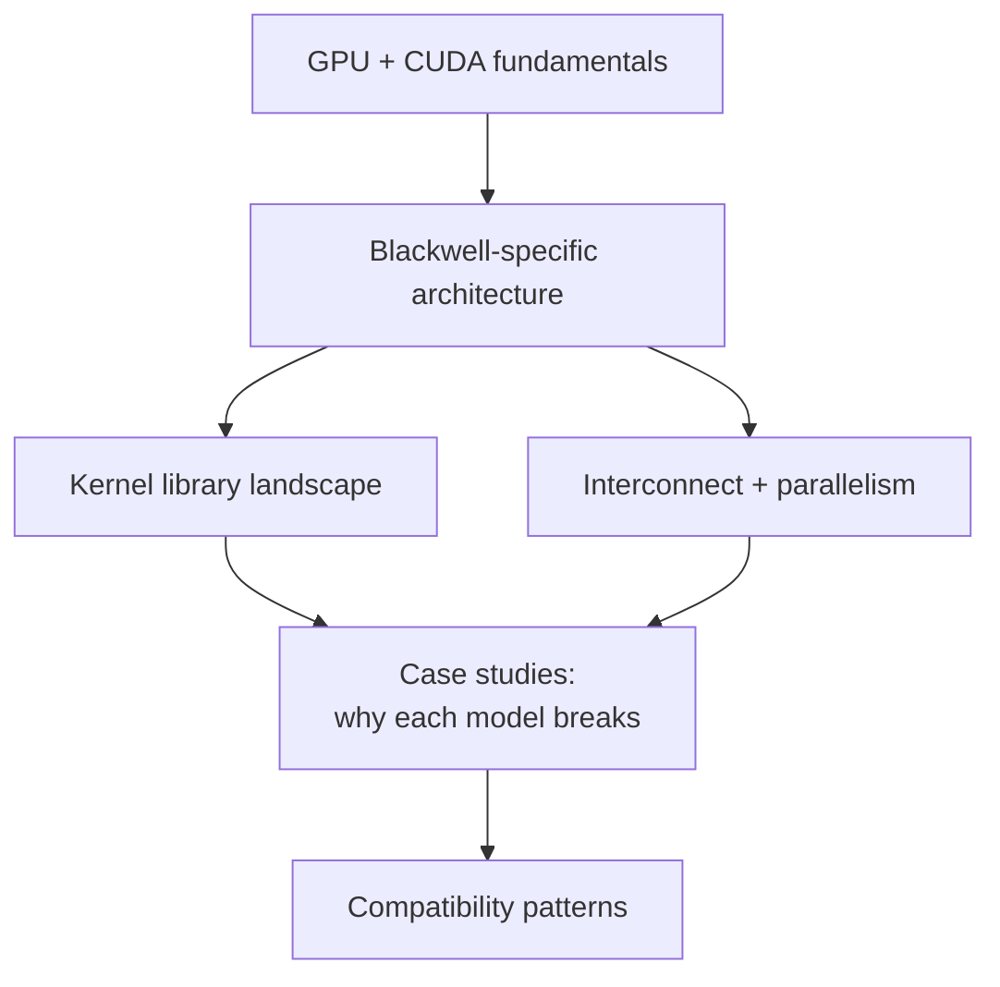

# Blackwell consumer-vs-datacenter wiki

A standalone, educational reference for understanding NVIDIA's Blackwell generation — specifically the architectural split between **SM 10.0** (datacenter Blackwell, GB100/GB200/GB300) and **SM 12.0** (workstation/consumer Blackwell, GB202: RTX PRO 6000 Workstation, RTX 5090, etc.).

The wiki exists because the modern open-weight inference stack (DeepSeek-V3/V4, Kimi-K2, GLM-5.x, Qwen-3-MoE) is built almost entirely against datacenter Blackwell assumptions: NVLink, Tensor Memory (TMEM), `tcgen05` instructions, 228 KiB shared-memory ceilings, MNNVL fabric, P2P atomics. Consumer Blackwell shares the same brand and the same Tensor Core generation but **does not** share that ISA or interconnect surface. Software written for one fails on the other in subtle, well-defined ways.

If you have a workstation Blackwell card and have ever asked "why doesn't this run?" — this wiki is the answer.

## What this wiki covers

- **[Fundamentals](fundamentals/index.md)**: GPU execution model, memory hierarchy, the CUDA compilation pipeline, tensor cores, number formats. The minimum context you need before the rest of the wiki makes sense.
- **[Blackwell](blackwell/index.md)**: SM100 vs SM120 in detail. `tcgen05`, TMEM, cluster-2 launches, the 99 KiB shared-memory cliff, NVFP4.
- **[Kernel libraries](kernels/index.md)**: CUTLASS, FlashAttention, FlashInfer, DeepGEMM, vLLM, SGLang, TensorRT-LLM, Marlin, Triton, TransformerEngine, NVSHMEM. What each one does, where SM100 vs SM120 support diverges, and how to read their issue trackers for compatibility hints.
- **[Interconnect](interconnect/index.md)**: NVLink vs NVSwitch vs PCIe. Why MoE all-to-all is bandwidth-and-atomics-bound. The EP-vs-TP tradeoff.
- **[Case studies](case-studies/index.md)**: DeepSeek-V3/V4-Flash, Kimi-K2.x, GLM-5.x. For each, what assumptions the model + its reference deployment makes, and which assumptions are violated on workstation Blackwell.
- **[Compatibility patterns](compatibility/index.md)**: how to translate SM100 kernels to SM120, how to rewrite EP plans for non-NVLink topologies, how to detect a topology mismatch at runtime. General techniques, not a specific implementation.
- **[Reference](reference/index.md)**: glossary, abbreviations, bibliography.

## What this wiki does not cover

- **Training.** Inference only. Training has its own concerns (gradient communication, mixed-precision optimizers, fault recovery) that don't apply here.
- **Multi-node.** Single-node only. The interconnect story changes substantially when you cross a network boundary.
- **Hopper, Ampere, or earlier.** Mentioned for contrast but not the focus.
- **AMD, Intel, or non-NVIDIA GPUs.** The kernel-library and ISA story is NVIDIA-specific.
- **Specific commercial products or buying advice.** This is technical, not a recommendation.

## Audience

The wiki is written for one of three reader types, in order of how much benefit they'll get:

1. **An ML engineer holding a workstation Blackwell card** trying to understand why model-X-from-the-frontier-lab won't run, or runs at 5 % of the throughput it "should." You'll want to read top-to-bottom.
2. **A CUDA developer porting kernels** between datacenter and consumer Blackwell. Skip to [Blackwell](blackwell/index.md) and [Kernels](kernels/index.md).
3. **A systems researcher or curious reader** who wants to understand what happened at the Blackwell-generation boundary and why "the same architecture" produced two different ISAs. The case studies are the most interesting part.

## How to read it

Three suggested paths through the material:

**Linear (~3–4 hours):** Start at [Fundamentals](fundamentals/index.md) and read every page in the sidebar order. By the end you'll be able to read a CUTLASS issue tracker thread and understand it without a glossary.

**Top-down (~1 hour):** Read this overview, then [Architecture](overview/architecture.md) (the one-page map), then jump to the [case study](case-studies/index.md) for whichever model you actually care about, then back-fill prerequisites as needed.

**Reference (~5 minutes per lookup):** Use the [Glossary](overview/glossary.md) and [Reference index](reference/index.md) like a man-page.

## A note on dates

The wiki reflects the state of the open-source GPU-inference ecosystem as of early 2026. Specific kernel-library version numbers (CUTLASS 3.x, sglang 0.5.x, FlashInfer 0.6.x) and PTX ISA version (8.5) are pinned in the text where they matter. Treat anything that says "as of 2026" as a snapshot, not a permanent truth — these libraries change every few weeks.

---

*Source on [GitHub](https://github.com/0xSero/blackwell-gpu-wiki). MIT-licensed.*
