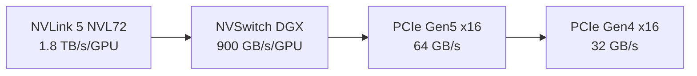

# Interconnect and parallelism

How GPUs talk to each other, and why this dominates the performance story for MoE inference. Workstation Blackwell's lack of NVLink is the second-most consequential constraint after the SM ISA split.

## Pages in this section

- [`nvlink-vs-pcie`](nvlink-vs-pcie.md) — bandwidth, latency, and topology
- [`p2p-and-atomics`](p2p-and-atomics.md) — peer-to-peer features and the atomics blocker
- [`moe-parallelism`](moe-parallelism.md) — TP, PP, EP, and when each wins

## The headline numbers

The bandwidth gap between datacenter NVLink and consumer PCIe is roughly **30–55×**. For most kernels (compute-bound dense matmul), this doesn't matter — the bandwidth is between GPUs but the work happens within them. For MoE all-to-all, this is the dominant performance number.

## Why it matters for MoE

A MoE layer with N experts and top-k routing has the following data flow per token:

1. Compute routing scores (small)
2. Dispatch token's hidden state to k experts (= cross-GPU send if experts live elsewhere)
3. Each expert runs its FFN
4. Combine k outputs back into the token's GPU (cross-GPU recv)

For Expert Parallelism (EP) where N experts are split across N GPUs, steps 2 and 4 are **all-to-all** operations whose volume scales with `N × hidden_size × tokens_per_step`. For a model like DeepSeek-V3 (N=256, hidden=7168, batch≈64), this is on the order of **gigabytes per step**.

On NVLink: the all-to-all completes in microseconds.
On PCIe: it takes hundreds of microseconds to milliseconds.

For decode (where each step produces 1 token), this directly increases per-token latency. Throughput collapses by 30–50×.

## Why it doesn't matter for non-MoE

Dense models (Llama, Mistral, GLM-4) use **only Tensor Parallelism (TP)** for multi-GPU serving. TP requires only an `all_reduce` per layer (not all-to-all), and the volume is much smaller (proportional to sequence length, not vocabulary). PCIe Gen4 is sufficient for TP with minimal slowdown.

So the workstation-Blackwell "interconnect penalty" is **MoE-specific**, not general.

## What you can do about it

Three approaches:

### 1. Avoid the all-to-all entirely

Use TP+PP instead of EP. Each GPU stores all experts (memory cost) but the all-to-all becomes a permutation within a single GPU. See [`moe-parallelism`](moe-parallelism.md).

### 2. Optimize the all-to-all

Use NCCL `all_to_all_single` instead of NVSHMEM-based one-shot. Slower than the optimal datacenter path, but avoids the atomics blocker. See [`p2p-and-atomics`](p2p-and-atomics.md).

### 3. Accept the cost

For some applications (offline batched inference, low concurrency, models small enough that overall throughput is fine), the EP-on-PCIe path is acceptable even at reduced speed.

In practice, **option 1 is what most workstation Blackwell deployments choose** — for both architectural cleanliness and because the other options come with their own gotchas.

## Reading order

[`nvlink-vs-pcie`](nvlink-vs-pcie.md) first for the topology numbers, then [`p2p-and-atomics`](p2p-and-atomics.md) for the technical detail of why "PCIe is slower" turns into "PCIe doesn't work" in some cases, then [`moe-parallelism`](moe-parallelism.md) for how to redesign around the constraint.
