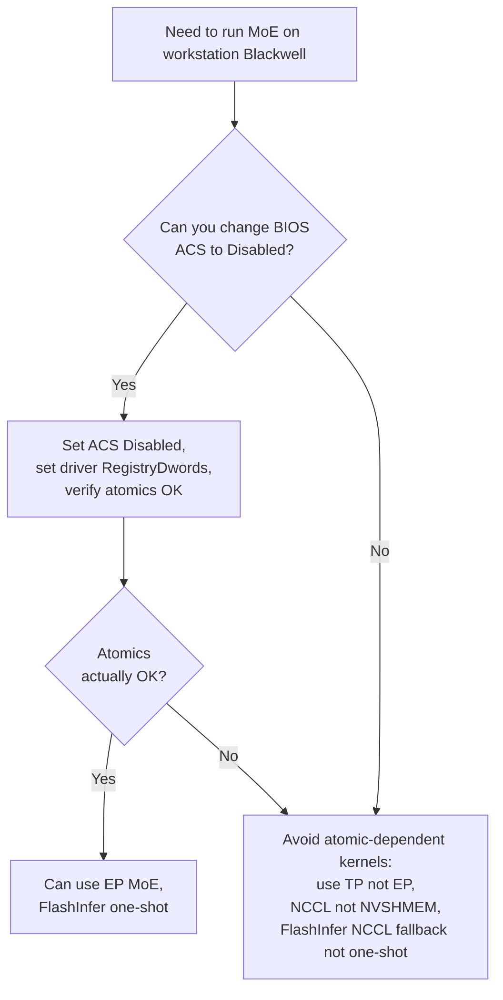

# P2P and atomics

Peer-to-peer GPU memory access, and the atomic operations that ride on top. The atomics question is the difference between "MoE all-to-all is slow" and "MoE all-to-all doesn't work at all."

## What "P2P" means

P2P (peer-to-peer) GPU memory access is the ability of one GPU to read/write another GPU's memory **directly**, without copying through host RAM as an intermediate.

The driver enables P2P selectively. To check:

```bash
nvidia-smi topo -p2p r          # which pairs can do P2P reads
nvidia-smi topo -p2p w          # writes
nvidia-smi topo -p2p a          # atomic operations
```

Output is a matrix where each cell is one of:

- `OK` — supported and enabled
- `NS` — Not Supported (hardware/driver doesn't allow it)
- `X` — diagonal (a GPU's own memory)

## Three operation classes

| Class | What | Latency | Use cases |
| --- | --- | --- | --- |
| **Reads (`p2p r`)** | GPU A reads from GPU B's HBM | high but tolerable | distributed inference activations, weight prefetch |
| **Writes (`p2p w`)** | GPU A writes to GPU B's HBM | similar to reads | NCCL P2P sends, NVSHMEM puts |
| **Atomics (`p2p a`)** | GPU A does atomic op on GPU B's HBM | slowest, requires special hardware support | completion flags, lock-free synchronization, NVSHMEM signal/wait |

On NVLink, all three are typically supported and fast. On PCIe, **reads and writes are usually OK; atomics are typically NS** on consumer cards by default.

## Why atomics are special

A peer-to-peer atomic operation (e.g., `atomicAdd` on a remote GPU's memory) requires the PCIe fabric and root complex to **coordinate transactions** in a way that's not needed for plain reads/writes. Specifically:

- The atomic must be **indivisible** with respect to other accesses to the same address
- The fabric must serialize concurrent atomics from different sources
- Each root complex must implement the AtomicOp PCIe extensions

PCIe Gen3 added the `AtomicOp` capability. PCIe Gen4 / Gen5 build on it. But **whether a given PCIe path actually supports AtomicOp depends on**:

- Both endpoints (GPU and root complex) declaring support
- The intermediate fabric (PCIe switches, root complex routing) propagating it
- The driver/firmware **enabling** it (often gated as a "datacenter feature")

On consumer GPUs, NVIDIA gates AtomicOp support **off by default** — partly to differentiate from datacenter products, partly because validation effort for consumer SKUs doesn't include atomic verification.

## Enabling atomics on consumer Blackwell

Two settings, both required:

### 1. BIOS: ACS Disable

ACS (Access Control Services) is a PCIe feature that, when **enabled**, isolates devices into separate IOMMU groups and **blocks** P2P atomics across groups.

- ACS Enabled → atomics blocked
- ACS Disabled → atomics allowed (within hardware capability)

The setting lives in motherboard BIOS, typically:

```
Advanced → AMD CBS → NBIO Common Options → ACS Enable: Disabled
```

(Or the Intel equivalent. Naming varies by vendor; "ACS" is the keyword to look for.)

Some workstation motherboards **do not** expose this setting, or expose it but ignore the change (BIOS bug). Server motherboards almost always expose it.

### 2. Driver: `RMDisableFeatureDisablement`

A NVIDIA driver registry-dwords setting that overrides the consumer-card atomic gating:

```
# In /etc/modprobe.d/nvidia-unlock.conf:
options nvidia NVreg_RegistryDwords="RMDisableFeatureDisablement=1"
```

Then reload the nvidia kernel module:

```bash
sudo systemctl stop docker.service
sudo modprobe -r nvidia_uvm nvidia_drm nvidia_modeset nvidia
sudo modprobe nvidia
sudo systemctl start docker.service
```

This re-enables features that the driver normally disables for product segmentation, including P2P atomics where hardware permits.

## Verifying atomics

After applying both settings:

```bash
nvidia-smi topo -p2p a
```

If the off-diagonal cells show `OK`, atomics are working. If they show `NS` despite both settings being applied, one of:

- BIOS isn't actually applying the ACS Disable
- The motherboard's PCIe routing doesn't support AtomicOp for that path
- The driver registry-dwords didn't take effect (verify with `cat /proc/driver/nvidia/params | grep RegistryDwords`)

## When atomics matter

Several inference-stack components depend on P2P atomics:

- **FlashInfer's MoE one-shot all-to-all** — busy-polls on completion flags updated via atomic writes
- **NVSHMEM signal/wait pairs** — same pattern, generalized
- **Some custom MoE dispatch kernels** — DeepEP variants, custom CUTLASS templates
- **Some attention kernels with cross-GPU KV sharing** — rare but present in some experimental stacks

If you're running any of these on a configuration where atomics are NS, the kernel **busy-polls forever**, the watchdog times out at 60 seconds, and the server crashes.

The error message looks like:

```
Rank 0 timed out waiting for completion flag from rank 1
Rank 1 timed out waiting for completion flag from rank 2
...
cudaFuncSetAttribute ... unspecified launch failure at cutlass_fused_moe_kernels.cuh:417
```

The "completion flag" terminology is your clue — it's a busy-poll on an atomic-updated flag.

## When atomics don't matter

Many workloads don't need atomics at all:

- **NCCL collectives** (allreduce, allgather, all-to-all) use SM-resident scheduling and don't need P2P atomics
- **Tensor parallelism** within a single TP group uses NCCL allreduce
- **Pipeline parallelism** uses NCCL P2P sends/recvs
- **Most attention kernels** are single-GPU (KV cache lives on one rank)

If your inference stack uses only NCCL and not NVSHMEM-style one-sided ops, atomics being NS is invisible.

## A pragmatic decision tree



In practice, "can you change BIOS" is often "no" — many workstation motherboards don't expose ACS Disable, or the BIOS ignores it. So the most common workstation Blackwell deployment ends up in the "avoid atomic-dependent kernels" branch.

## Why this gate exists at all

NVIDIA's product segmentation: PCIe atomics is a "datacenter feature" that's part of what you pay for in a datacenter SKU. Consumer cards are deliberately limited to encourage commercial deployments to use datacenter parts.

The technical implementation is `RMDisableFeatureDisablement`: a runtime knob that flips the segmentation. It exists because validation infrastructure shares code between datacenter and consumer products; flipping the knob enables the datacenter code paths.

NVIDIA does not officially "support" this knob on consumer cards, but it's used widely in research and small-scale deployments. Some specific atomic patterns work; others have edge-case bugs because they were never tested on consumer hardware.

## Summary

| Step | Effect |
| --- | --- |
| `nvidia-smi topo -p2p a` shows `NS` | atomics blocked, MoE one-shot a2a will fail |
| BIOS: ACS Enabled | one of two reasons atomics are blocked |
| BIOS: ACS Disabled | first half of the unlock |
| Driver default | second of two reasons atomics are blocked |
| Driver `RMDisableFeatureDisablement=1` | second half of the unlock |
| Both applied → `nvidia-smi topo -p2p a` shows `OK` | atomics enabled, MoE one-shot a2a should work |
| Hardware doesn't physically support → still NS | no software fix; use NCCL fallback |

## See also

- [`nvlink-vs-pcie`](nvlink-vs-pcie.md) — the bandwidth context
- [`moe-parallelism`](moe-parallelism.md) — what to do when atomics aren't available
- [`kernels/flashinfer`](../kernels/flashinfer.md) — the kernel that exposes this most
- *PCIe Specification 4.0/5.0*, "AtomicOp" extension
- NVIDIA developer forum threads on `RMDisableFeatureDisablement`
