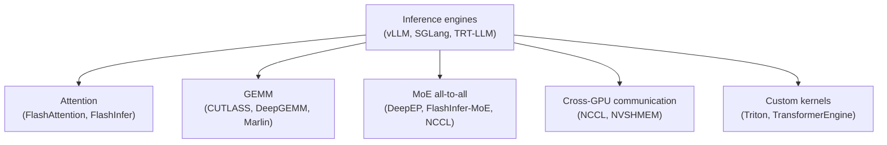

# Kernel libraries

The set of CUDA kernel libraries that modern inference engines compose. Each one has a specific role, a specific Blackwell-era story, and a specific set of failure modes on workstation Blackwell.

## The landscape

Inference engines aren't kernel implementations themselves — they're orchestrators. Each request goes through layers of dispatch: framework → kernel library → architecture-specific code path. The "does it work on SM120" question is answered at the bottom layer.

## Pages in this section

- [`cutlass`](cutlass.md) — NVIDIA's GEMM template library
- [`flashattention`](flashattention.md) — the FA-2 / FA-3 family
- [`flashinfer`](flashinfer.md) — attention + MoE for serving
- [`deepgemm`](deepgemm.md) — DeepSeek's high-throughput FP8/FP4 GEMM
- [`marlin-and-friends`](marlin-and-friends.md) — INT4 paths (Marlin, AWQ, GPTQ)
- [`triton-and-transformerengine`](triton-and-transformerengine.md) — DSL kernels and NVIDIA's mixed-precision wrappers
- [`nvshmem-and-deepep`](nvshmem-and-deepep.md) — communication primitives for MoE
- [`inference-engines`](inference-engines.md) — vLLM, SGLang, TRT-LLM as kernel composers

## How to read this section

Each library page follows the same template:

1. **What it is** — purpose, who maintains it
2. **What it depends on** — its place in the stack
3. **SM100 story** — how datacenter Blackwell is supported
4. **SM120 story** — what works, what doesn't, what's gated
5. **Common failures** — the specific errors users encounter
6. **Detection** — how to figure out whether a binary uses this library and which arch it targets
7. **References** — where to read more

If you're trying to understand a specific failure ("why doesn't FlashInfer's MoE all-to-all work?"), find the relevant library page and read sections 4–5.

## Compatibility summary

A bird's-eye view of where each library sits:

| Library | SM100 status | SM120 status | Notes |
| --- | --- | --- | --- |
| CUTLASS | full support, `sm_100a` templates | partial, `sm_120` templates exist; SMEM cliff is the main gotcha | NVIDIA-maintained |
| FlashAttention 2 | works | works (FA-2 is portable) | Tri Dao, MIT |
| FlashAttention 3 | yes (Hopper-extended) | not yet — Blackwell port in flight | |
| FlashInfer | full | partial — NVFP4 ok, MoE one-shot a2a needs P2P atomics | |
| DeepGEMM | full | unsupported as shipped, port in progress | DeepSeek-AI |
| Marlin | not the optimal path | works fine; older arch, broadly supported | |
| Triton | works | works | DSL compiler — most kernels portable |
| TransformerEngine | NVIDIA's reference | evolving | NVIDIA-maintained |
| NVSHMEM | requires NVLink for performance | unusably slow without NVLink | NVIDIA |
| DeepEP intranode | requires NVLink + NVSHMEM | doesn't run | DeepSeek-AI |
| DeepEP internode | requires RDMA NIC | doesn't run | |
| vLLM | works | works for non-DSA models; DSA needs SM120 fix | |
| SGLang | works | works (specific versions, with patches) | |
| TensorRT-LLM | works | builds on SM120; precompiled engines target SM100 | NVIDIA |

The pattern: **anything compiled by NVIDIA against datacenter Blackwell defaults to `sm_100a` and ships only that target.** Workstation Blackwell support requires either a recompile or an SM120-targeted variant.

## Why so many libraries?

A reasonable question. The fragmentation reflects different optimization domains:

- **Attention vs GEMM** are different problems with different optimal kernel structures (irregular sparsity vs dense matmul)
- **MoE all-to-all** is a *communication* primitive, not a compute one
- **Quantization** (NVFP4 vs MX-FP4 vs INT4) changes the kernel inner loop substantially
- **Different arches** (SM80, SM90, SM100, SM120) each motivate different tile shapes and pipelines

The combinatorial explosion produces ~10 distinct libraries, each maintained by a different team. The inference engine on top has the unenviable job of choosing the right one for each layer of each model.

## A note on versioning

These libraries change rapidly — most ship a new release every 2–4 weeks. Specific behaviors documented on these pages are pinned to versions current as of early 2026:

- CUTLASS 3.6.x
- FlashAttention 2.7.x, FA-3 development
- FlashInfer 0.6.x – 0.7.x
- DeepGEMM as of `deepseek-ai/DeepGEMM` main
- vLLM 0.7.x
- SGLang 0.5.x
- TensorRT-LLM 0.18.x

When you read this in mid-2026 or later, expect specific commit hashes and versions to have moved. The architectural facts (which library uses `tcgen05`, which one needs P2P atomics) evolve more slowly than the version numbers.
