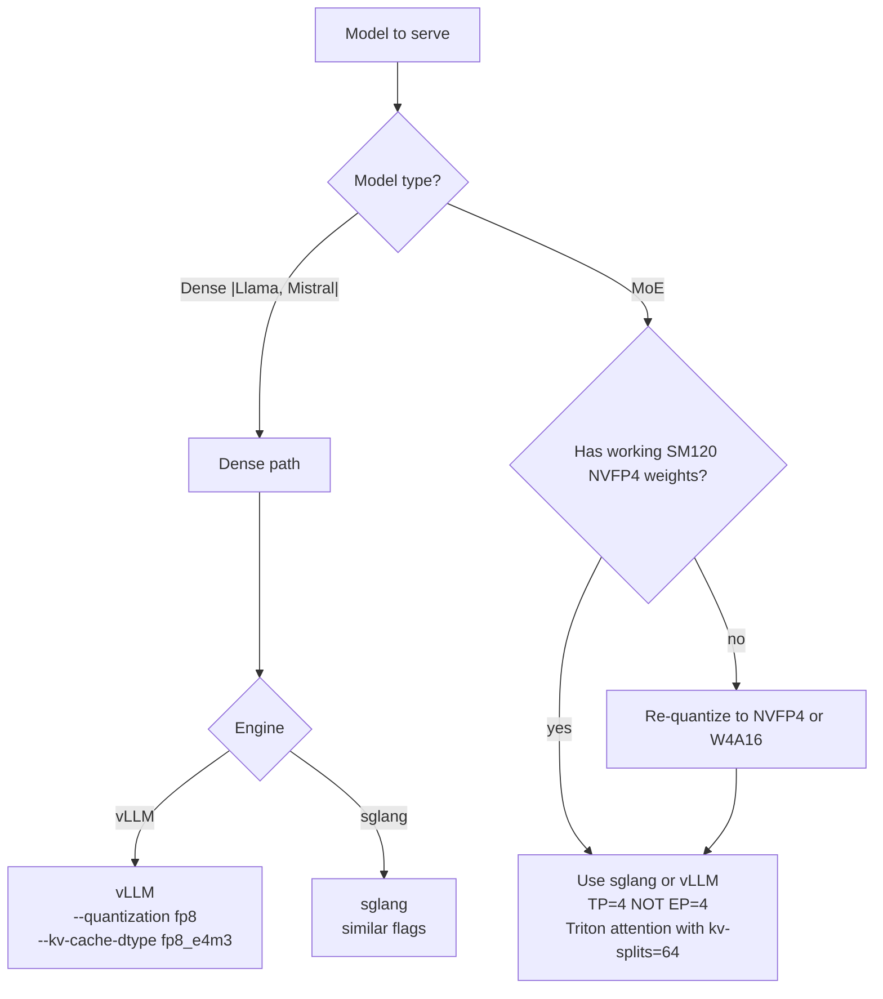

# Inference engines: vLLM, SGLang, TensorRT-LLM

The orchestrators on top of the kernel libraries. They take a model + a request and decide which kernel runs for which layer. Understanding their dispatch logic is how you understand which low-level kernel a given inference call ends up touching.

## What an inference engine does

In rough order of execution:

1. **Loads weights** from disk into GPU memory, applying parallelism plan (TP/PP/EP)
2. **Allocates KV cache** (page-attention layout, fp8 or bf16, chosen at startup)
3. **Listens** on an HTTP / gRPC API
4. **Schedules requests** into batches (continuous batching, radix-tree caching, etc.)
5. **Dispatches** each forward pass through the layer-by-layer kernel pipeline
6. **Streams** output tokens back

The "dispatch" step is where the architecture matters: for each layer, the engine picks an attention kernel (FlashAttention, FlashInfer, or a Triton kernel), a GEMM kernel (CUTLASS, DeepGEMM, Marlin, or a custom path), and a MoE kernel (FlashInfer-MoE, DeepEP, or NCCL fallback).

## vLLM

GitHub: `vllm-project/vllm`. License: Apache-2.0. Originally UC Berkeley; now community + Anyscale.

### What's distinctive

- **PagedAttention**: pioneered the page-attention KV cache layout that's now standard
- **Continuous batching**: industry-leading scheduler
- **Broad model support**: catches up on new model architectures within days

### SM120 story

Most of vLLM works on workstation Blackwell. The exceptions:

- **Models using DSA (Differential Sparse Attention)**, particularly some GLM-5 variants, hit a kernel that doesn't compile on SM120. There's an open issue and PR landed in vLLM 0.7.x.
- **Some MoE paths** route through FlashInfer's MoE kernels, which can hit the atomics blocker.

For most non-DSA, non-MoE-EP models, vLLM "just works" on SM120 with appropriate flags.

### Key flags for SM120

```bash
# Disable kernel paths that don't work
--quantization fp4               # Use NVFP4 (CUTLASS path)
--kv-cache-dtype fp8_e4m3        # Compact KV
--enforce-eager                  # Skip CUDA graph capture if it fails

# Tensor parallelism, no expert parallelism
--tensor-parallel-size 4
--pipeline-parallel-size 1
```

## SGLang

GitHub: `sgl-project/sglang`. License: Apache-2.0. Originally LMSYS / UC Berkeley; community-maintained.

### What's distinctive

- **RadixAttention**: aggressive prefix caching across requests
- **Frontend DSL**: programmable inference (control flow, structured outputs)
- **MoE focus**: among the better engines for MoE serving

### SM120 story

SGLang has explicit SM120 support since version 0.5.10+. Supports:

- NVFP4 weights via FlashInfer + CUTLASS
- FP8 KV cache via FlashInfer's KV-attention
- Triton-based attention with KV-splits (the long-context fast path on SM120)
- TP=4 MoE without invoking EP-class kernels

### Key flags for SM120

```bash
# Architecture-friendly
--quantization modelopt_fp4
--kv-cache-dtype fp8_e4m3
--attention-backend auto         # Lets sglang pick Triton on SM120
--triton-attention-num-kv-splits 64   # The high-impact knob

# Plan
--tensor-parallel-size 4

# Performance knobs
--mem-fraction-static 0.94
--page-size 128                  # 64 if MTP enabled
```

### SGLang's environment variables

```bash
SGLANG_ENABLE_DEEP_GEMM=0        # DeepGEMM is SM100-only as of early 2026
SGLANG_DISABLE_DEEP_GEMM=1
SGLANG_ENABLE_JIT_DEEPGEMM=0
SGLANG_PYNCCL_SKIP_WARMUP=1      # Avoid TP=4 warmup deadlock on PCIe
```

These are belt-and-braces: they tell sglang to skip kernel paths known to be SM100-specific.

## TensorRT-LLM

GitHub: `NVIDIA/TensorRT-LLM`. License: Apache-2.0. Maintained by NVIDIA.

### What's distinctive

- **Maximum throughput at the low end of model size** (under 70B parameters); compiles to a TensorRT engine ahead of time
- **NVIDIA-blessed, with the most aggressive use of CUTLASS templates**
- **Best-in-class FP8 inference** on Hopper / SM100

### SM120 story

TRT-LLM is "supposed to" work on SM120 but ships precompiled engines targeting `sm_100a`. To run on SM120 you typically:

1. Build TRT-LLM from source with `--target-arch sm_120`
2. Compile your model to a TensorRT engine on the SM120 device (engines aren't portable across architectures)

This is gnarly enough that most workstation-Blackwell users skip TRT-LLM and use vLLM or sglang. TRT-LLM's advantages (peak Hopper throughput) don't translate to SM120 anyway.

### When you'd still pick TRT-LLM

- Need NVIDIA-verified deployment (e.g., for a customer requiring NVIDIA validation)
- Specific kernel exists in TRT-LLM that hasn't been ported elsewhere
- Already comfortable with the TensorRT toolchain

## Decision tree for SM120 deployment



The dominant pattern: **TP-only parallelism**, **NVFP4 weights**, **FP8 KV cache**, **Triton attention with high kv-splits**, **DeepGEMM disabled in favor of CUTLASS**.

## Common failures shared across engines

These show up regardless of which engine you pick on SM120:

1. **`no kernel image is available`** — kernel library shipped only `sm_100a` cubins. Reinstall a SM120-aware version of the offending library (FlashInfer, DeepGEMM, etc.).

2. **NCCL warmup deadlock at TP=4** — the engine's distributed-init NCCL warmup phase deadlocks on cross-root-complex P2P. Fix: `SGLANG_PYNCCL_SKIP_WARMUP=1` (sglang) or `VLLM_DISABLE_NCCL_WARMUP=1` (vLLM, where supported).

3. **MoE all-to-all timeout** — see [`flashinfer`](flashinfer.md) and [`nvshmem-and-deepep`](nvshmem-and-deepep.md). The fix is plan-level: switch from EP to TP.

4. **Output is gibberish at long context** — likely kv-splits is at the default (8). Set `triton-attention-num-kv-splits=64`.

5. **OOM during prefill at long prompt** — `mem-fraction-static` too aggressive (>0.95). Drop to 0.94 or 0.92.

## Engine version pinning

Specific behaviors documented above are pinned to versions current as of early 2026:

- vLLM 0.7.x
- SGLang 0.5.10–0.5.11
- TensorRT-LLM 0.18.x

Newer or older versions may behave differently. Check release notes before assuming a flag still does what this wiki says.

## See also

- [`flashinfer`](flashinfer.md), [`flashattention`](flashattention.md), [`cutlass`](cutlass.md) — what the engines call into
- [`compatibility/`](../compatibility/index.md) — patterns for making things work
- [`case-studies/`](../case-studies/index.md) — model-specific deployment recipes
- *Kwon et al., "Efficient Memory Management for Large Language Model Serving with PagedAttention"* (vLLM, 2023)
- *Zheng et al., "SGLang: Efficient Execution of Structured Language Model Programs"* (2024)
- vLLM, SGLang, TRT-LLM project documentation
