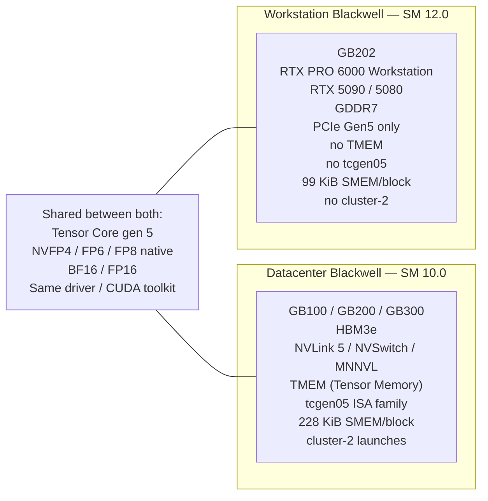

# The big picture

A one-page map of how every concept in this wiki fits together. If you're going to read only one page, this is the one.

## The central claim

> The "Blackwell" generation contains **two distinct architectures** that share a brand, a Tensor Core generation, and almost nothing else that matters at the kernel level.

Same Tensor Cores; different surface to drive them. The split is not gradual; it's binary at the ISA level. There is no "compatibility mode."

## Five consequences, in increasing order of subtlety

### 1. SM100-targeted cubins refuse to run on SM120

The most obvious one. A `.cubin` file (compiled CUDA binary) embeds a target architecture. The driver checks the architecture before launch. SM 10.0 binaries fail to load on SM 12.0 with a clean error. This is what most users encounter first.

### 2. SM100-compiled PTX fails to assemble on SM120

A step subtler. PTX (Parallel Thread eXecution) is the intermediate representation. PTX containing `tcgen05.*` instructions or TMEM operations cannot be assembled by `ptxas` for `sm_120` — it errors out. So even a "JIT from PTX" path doesn't save you if the PTX itself uses datacenter-only instructions.

### 3. SM120-compatible PTX still hits the SMEM cliff

Subtler still. Many CUTLASS templates compile cleanly for both targets but request **228 KiB of shared memory per block**, fitting datacenter Blackwell's ceiling. On SM120 the per-block ceiling is **99 KiB**. The kernel still launches — but the extra SMEM allocation silently corrupts adjacent banks, producing zeroed or scrambled outputs with no error code.

### 4. NVLink vs PCIe collapses MoE throughput by 30–50×

Fully orthogonal to the SM ISA. NVLink 5 gives ~1.8 TB/s/GPU; consumer PCIe gives 32–64 GB/s/GPU pair. Mixture-of-Experts inference plans built around expert parallelism (EP) issue an all-to-all per token-step. On NVLink that's microseconds; on PCIe it's the dominant cost of inference. The fix isn't a new kernel; it's a different parallelism plan (TP+PP instead of EP).

### 5. P2P atomics are software-gated on consumer cards

The most subtle. Consumer drivers default-disable cross-GPU atomic operations over PCIe. Many "modern" MoE all-to-all kernels (FlashInfer one-shot, MNNVL) busy-poll on cross-rank atomic completion flags. With atomics gated off, the polling rank never sees the flag — the operation never completes — the watchdog kills the server. Enabling atomics requires both a BIOS option (ACS Disabled) and a driver registry knob.

## Reading order through the wiki

This map mirrors the sidebar order. Each consequence above corresponds to one or more deep-dive pages:

| Consequence | Read these pages |
| --- | --- |
| 1 + 2: ISA mismatch | [`fundamentals/cuda-pipeline`](../fundamentals/cuda-pipeline.md), [`blackwell/sm100-vs-sm120`](../blackwell/sm100-vs-sm120.md), [`blackwell/tcgen05-and-tmem`](../blackwell/tcgen05-and-tmem.md) |
| 3: SMEM cliff | [`fundamentals/memory-hierarchy`](../fundamentals/memory-hierarchy.md), [`blackwell/sm100-vs-sm120`](../blackwell/sm100-vs-sm120.md), [`kernels/cutlass`](../kernels/cutlass.md) |
| 4: MoE collapse | [`interconnect/nvlink-vs-pcie`](../interconnect/nvlink-vs-pcie.md), [`interconnect/moe-parallelism`](../interconnect/moe-parallelism.md) |
| 5: Atomics | [`interconnect/p2p-and-atomics`](../interconnect/p2p-and-atomics.md), [`kernels/flashinfer`](../kernels/flashinfer.md) |
| Synthesis | [`case-studies/`](../case-studies/index.md) (one page per model) |
| What to do | [`compatibility/`](../compatibility/index.md) (translation patterns, plan rewriting) |

## A taxonomy of what runs

For each model family, three questions determine whether it runs on consumer Blackwell:

1. **Does the model's reference inference stack use SM100-only instructions?** (e.g., DeepGEMM, FlashInfer's NVFP4 path, anything compiled for `sm_100a`.) If yes, you need substituted kernels.
2. **Does the parallelism plan assume NVLink-class all-to-all?** (e.g., EP=N over NVLink + NVSHMEM.) If yes, you need a plan rewrite to TP+PP.
3. **Does any kernel busy-poll on P2P atomics?** (e.g., FlashInfer one-shot a2a.) If yes, you need atomics enabled, or a different a2a kernel.

Each "yes" turns into one chapter of the case studies.

## Where this wiki is on the technical map

The territory:

- **Hardware** (chips, boards, interconnect) — addressed only as far as it constrains software
- **Driver + CUDA runtime** — covered to the extent it surfaces SM-version differences
- **PTX + cubin compilation pipeline** — covered in [`fundamentals/cuda-pipeline`](../fundamentals/cuda-pipeline.md)
- **Kernel libraries** — the bulk of [`kernels/`](../kernels/index.md)
- **Inference engines** (vLLM, sglang, TRT-LLM) — covered as kernel-library composers, not in framework-internals depth
- **Models** (their architectures, attention variants, MoE routing) — covered in [`case-studies/`](../case-studies/index.md) as the "what they assume" lens

The wiki sits at the **kernel-library and below** layer. It does not teach you how to write a transformer, or how to fine-tune one. It teaches you what NVIDIA shipped underneath those things on Blackwell, and where the vendors above NVIDIA cut corners that hurt only one half of the generation.

## Vocabulary preview

Three terms that recur on every page:

- **Compute capability** ("CC") — the SM-version pair, e.g., `7.0`, `8.0`, `9.0`, `10.0`, `12.0`. The two-digit string after the dot is the **major version**; the digit before is the **minor version**. Same major = related ISA; different major = potentially incompatible.
- **`sm_100` / `sm_120` / `sm_100a` / `sm_120f`** — the lowercase compiler-flag forms. Bare `sm_NN` is the architecture. The `a` suffix means "architecture-specific accelerated" (uses non-portable features). The `f` suffix means "forward-compatible" (uses only portable features).
- **NVFP4** — NVIDIA's variant of OCP MX-FP4: 4-bit elements grouped into blocks of 16, with a per-block FP8 (E4M3) scale factor. Native on **both** SM100 and SM120 — one of the few features that genuinely works the same on both.

The full list lives in the [glossary](glossary.md).

## Where to go next

- New to GPU programming generally? Start at [`fundamentals/index`](../fundamentals/index.md).
- Comfortable with CUDA, want the Blackwell story? Jump to [`blackwell/index`](../blackwell/index.md).
- Have a specific model failing right now? Find it in [`case-studies/index`](../case-studies/index.md).
